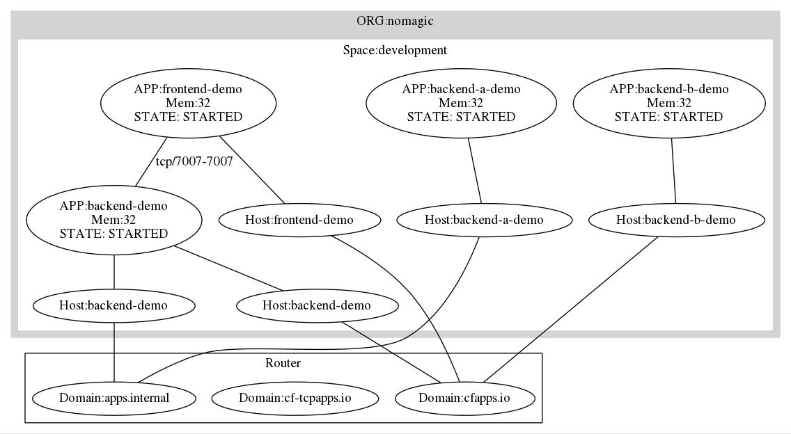

# cf2Graph
Simple script that parses Cloudfoundry Metadata to be fed into graphviz.
The script considers the following elements
 * Orgs
 * Spaces
 * Apps
 * Routes
 * Service Instances
 * Service Bindungs
 * Route Bindings
 * Network Policies 

# Prerequisites

## CF CLI
You will also need the [Cloud Foundry command line interface (CF CLI)](https://github.com/cloudfoundry/cli) on you PATH. This tool is used to communicate with Cloud Foundry Cloud Controller.
If want to visualize network policies you need at least CF CLI version 6.30 and at least Cloud Foundry version 1.12.

## cut
This command [cuts](https://www.gnu.org/software/coreutils/manual/html_node/The-cut-command.html) out columns or fields of input data. It is used to transform the necessary data.

## jq
You will need [jq](https://stedolan.github.io/jq/) on your PATH.
jq is a lightweight and flexible command-line JSON processor and it is used for transforming the json responses from the Cloud Foundry Cloud Controller API.

## Graphviz
[Graphviz](http://graphviz.org) is open source graph visualization software. 

# Usage

```sh
$  ./create.sh 'username' 'password'
```

# Samples

## Container Networking Examples on Pivotal Web Services


